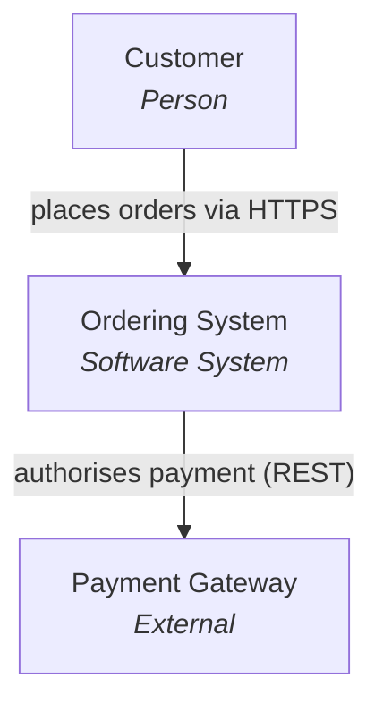
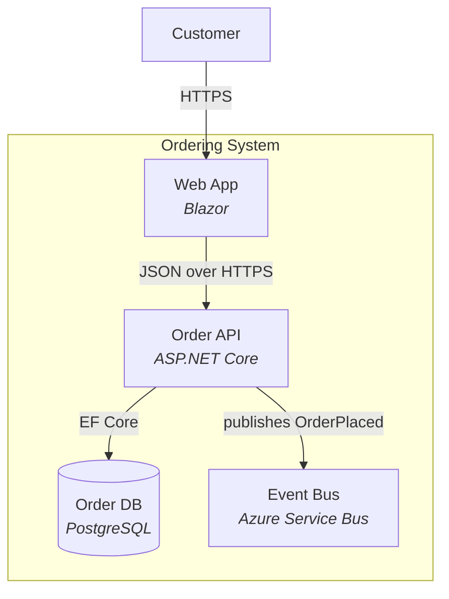
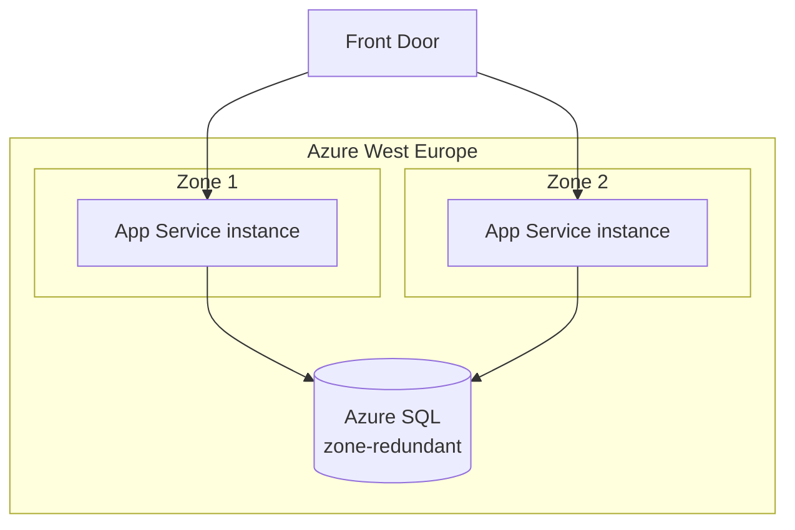

# C4 diagrams in Mermaid

Four levels. Most decisions need only the first two.

- **L1 Context** - the system as one box, plus users and external systems.
- **L2 Container** - deployable units: apps, services, databases, queues.
- **L3 Component** - inside one container. Only for the risky part.
- **L4 Code** - class level. Almost never worth drawing; the code is truer.

## Context (L1)



## Container (L2)



## Rules for readable diagrams

- Label every arrow with **what** crosses and **how**. An unlabelled arrow
  carries no information.
- The arrow points along the dependency, not along the data.
- Put the technology on each box. "Service" tells the reader nothing.
- One diagram, one level. Mixing levels is the most common mistake.
- If it does not fit on a screen, the level is wrong, not the diagram.

## Sequence diagrams

Use one when the *order* of interactions is the point - especially for the
failure path, which is the interesting case and usually the undrawn one.

```mermaid
sequenceDiagram
    participant C as Client
    participant A as Order API
    participant P as Payment Gateway
    C->>A: POST /orders
    A->>P: authorise (timeout 3s)
    alt authorised
        P-->>A: 200 approved
        A-->>C: 201 Created
    else timeout or 5xx
        P--xA: no response
        A-->>C: 503 with Retry-After
        Note over A: order stays PENDING;<br/>reconciler retries with the<br/>same idempotency key
    end
```

## Deployment view

Draw one when where things run is a real constraint - regions, VPCs,
availability zones, on-prem boundaries, data residency.


